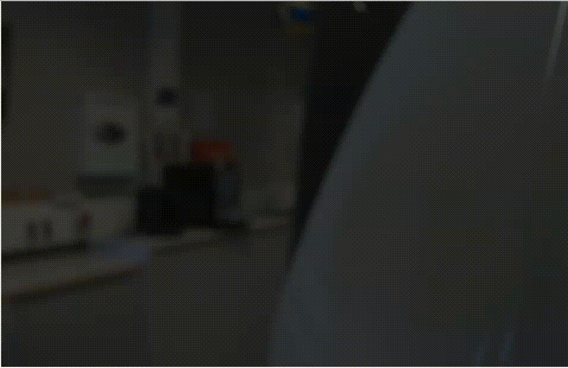
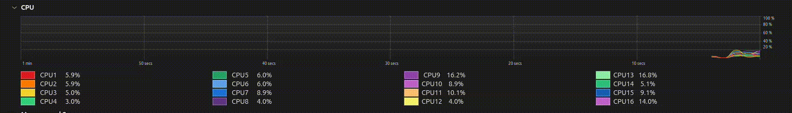
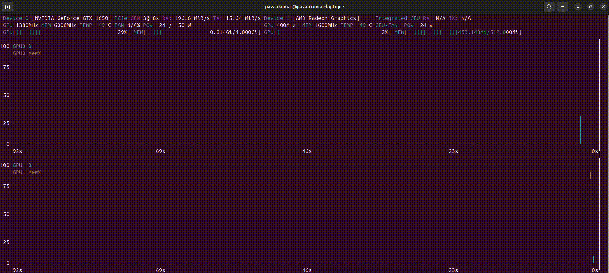
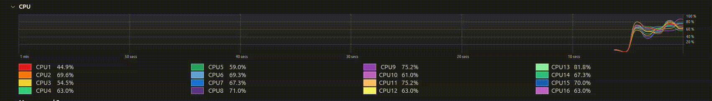
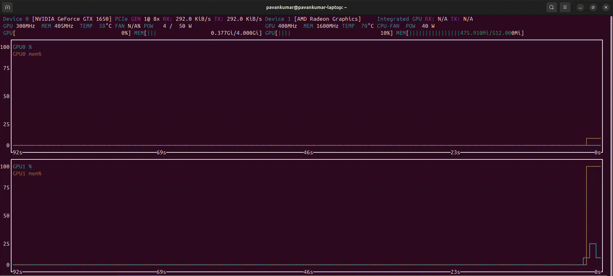

# Late Fusion Yolos CPP

<p align="center">
  
</p>

This repository contains a complete pipeline for multi-camera object detection and panoramic image stitching using YOLOv8 and ROS2. The project is divided into two main functional blocks: detection and fusion.
 
## Project Architecture
The system operates in a sequential pipeline:
* Perception (ros2_yolos_cpp): Processes raw camera feeds to perform real-time YOLO object detection.
* Stitching (late_fusion_for_yolos_cpp): Collects the processed frames from multiple cameras and fuses them into a single panoramic view.

## Features
- Supports 1-6 cameras
- Fresh-only detection fusion (no reuse across cycles)
- 2x3 image stitching layout
- Fully parameterized via YAML
- Compatible with ros2_yolos_cpp
- Designed for ROS 2 Jazzy

## Repository Structure
**1\.** **ros2_yolos_cpp**
This package is responsible for the initial object detection phase. 

Parent Repository : https://github.com/Geekgineer/ros2_yolos_cpp/tree/main
  * Functionality: Subscribes to raw camera topics and applies YOLOv8 inference.
  * Multi-Camera Support: Designed to run concurrent instances for multiple camera feeds (e.g., a 3-camera setup).
  * Output: Publishes processed images with bounding boxes and class labels.

## 🎬 Individual camera detection sample from Rviz
<table align="center" cellpadding="10">
 <tr>
    <td align="center" style="border:1px solid #ccc">
      
    </td>
    <td align="center" style="border:1px solid #ccc">
      
    </td>
  </tr>
 <tr>
    <td colspan="2" align="center" style="border:1px solid #ccc">
      
    </td>
  </tr>
</table>

**2\.** **late_fusion_for_yolos_cpp**  
This package handles the "Late Fusion" or panoramic stitching of the detected outputs.

* Functionality: Takes the YOLO-detected images from the three camera streams.
* Output: A stitched, panoramic image that maintains detection information across the entire field of view.

## 🎬 Panoramic stitched image sample from Rviz


## Getting Started  
Prerequisites
* **ROS2** : Jazzy
* **OpenCV** : 4.5+
* **CUDA** (Recommended for YOLO inference)
* **C++ Compiler**

### Build from Source
```bash
# Create workspace
mkdir -p ~/ros2_ws/src && cd ~/ros2_ws/src

# Clone package
git clone https://github.com/Pavankumarsp02/late_fusion_yolos_cpp.git

# Install dependencies
cd ~/ros2_ws
rosdep update && rosdep install --from-paths src --ignore-src -y
```
## Additional files and packages
* Executing **export_onnx.py** to get **yolov8n.onnx** and **yolov8n.pt**
* Generally this file throws error when tried to execute by command "python3 export_onnx.py"
* Simple solution is to create a venv and execute within venv

```bash
sudo apt install -y python3-venv python3-pip
python3 -m venv venv

source venv/bin/activate #activating python-venv
pip install ultralytics
python3 export_onnx.py   #after sucessful run, file yolov8n.onnx is created

#deactivating python-venv
deactivate

# Build (Release mode recommended for performance)
colcon build
source install/setup.bash
```

## 🛠️ Usage

### There are two ways to run the entire setup.

### 1. Manual executing
* Publishes `vision_msgs/Detection2DArray` with bounding boxes and class IDs.    
* To run the entire setup with all 3 cameras, we require 6 terminals.    
* The default commands runs on GPU, If your machine lacks one, neglect the `use_gpu:=true` from the execution command.

Terminal 1: (Running Yolo node for camera 2)
```bash
ros2 launch ros2_yolos_cpp detector2.launch.py \
  model_path:=src/ros2_yolos_cpp/yolov8n.onnx \
  labels_path:=src/ros2_yolos_cpp/coco.names \
  use_gpu:=true image_topic:=/lucid_vision/camera_2/image
```
Terminal 2: (Running Yolo node for camera 3)
```bash
ros2 launch ros2_yolos_cpp detector3.launch.py \
  model_path:=src/ros2_yolos_cpp/yolov8n.onnx \
  labels_path:=src/ros2_yolos_cpp/coco.names \
  use_gpu:=true image_topic:=/lucid_vision/camera_3/image
```
Terminal 3: (Running Yolo node for camera 4)
```bash
ros2 launch ros2_yolos_cpp detector4.launch.py \
  model_path:=src/ros2_yolos_cpp/yolov8n.onnx \
  labels_path:=src/ros2_yolos_cpp/coco.names \
  use_gpu:=true image_topic:=/lucid_vision/camera_4/image
```
Terminal 4: (Configuring and Activating yolo nodes)
```bash
ros2 lifecycle set /yolos_detector2 configure
ros2 lifecycle set /yolos_detector3 configure
ros2 lifecycle set /yolos_detector4 configure
ros2 lifecycle set /yolos_detector2 activate
ros2 lifecycle set /yolos_detector3 activate
ros2 lifecycle set /yolos_detector4 activate
```
Terminal 5: (Enabling Late Fusion Node)
```bash
ros2 launch late_fusion_for_yolos_cpp launch_fusion_node.py
```
Terminal 6: (To visualize output - Rviz2)  
```bash
rviz2
```

* Select topic which you want to view visually.
 <table align="center" cellpadding="10"> 
  <tr>
    <td colspan="2" align="center" style="border:1px solid #ccc">
      
    </td>
  </tr>
 </table>
 
### 2. Auto executing using tmuxinator
* Installing Tmuxinator:
  ```bash
  apt install tmuxinator
  ``` 
  Rename ***auto_start.yml*** file as `.tmuxinator.yml`  
  ```bash
  tmuxinator start
  ```
  Visualize using Rviz as shown in previous step

## Hardware Usage Data    
### GPU Mode (i.e `use_gpu:=true`)
* CPU

 <table align="center" cellpadding="10"> 
  <tr>
    <td colspan="2" align="center" style="border:1px solid #ccc">
      
    </td>
  </tr>
 </table>
 
 * GPU
   
  <table align="center" cellpadding="10"> 
  <tr>
    <td colspan="2" align="center" style="border:1px solid #ccc">
      
    </td>
  </tr>
 </table>

### CPU Mode (neglected use_gpu:=true)
* CPU
 <table align="center" cellpadding="10"> 
  <tr>
    <td colspan="2" align="center" style="border:1px solid #ccc">
      
    </td>
  </tr>
 </table>
 
 * GPU
   
  <table align="center" cellpadding="10"> 
  <tr>
    <td colspan="2" align="center" style="border:1px solid #ccc">
      
    </td>
  </tr>
 </table>

## 🐳 Docker

Run the stack without installing dependencies locally.
```bash
# Build Docker image
docker build -t ros2_yolos_cpp .
```
* Starting Docker 
```bash
docker run --gpus all -it <docker_image_name> /bin/bash
```
* Sourcing inside the Docker Container
```bash
source install/setup.bash
```
* Tmux is already pre-installed in the docker, run `tmux`, split terminal and follow the previous mentioned procedure (Method 1) to run the setup.    
* If you want to use Method 2 (automatic setup), make use of auto_start2.yml file - Replace the <container_name> with your docker container name in file and rename the file as `.tmuxinator.yml`
```bash
tmuxinator start
```
